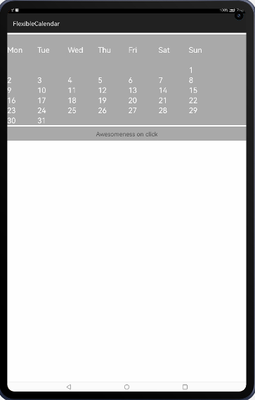
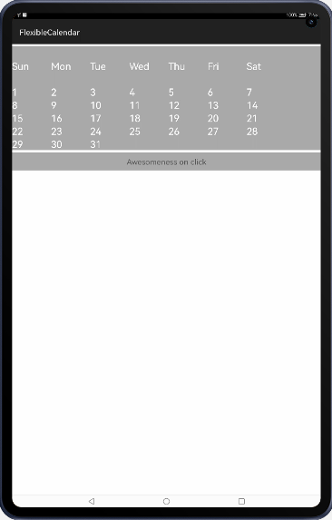

# FlexibleCalendar
=================
[](https://sonarcloud.io/dashboard?id=applibgroup_FlexibleCalendar)
[](https://github.com/applibgroup/FlexibleCalendar/actions/workflows/main.yml)

Introduction
------------
A customizable calendar with customizable events.

# Source

The code in this repository was inspired from [p-v/FlexibleCalendar - v1.2.1](https://github.com/p-v/FlexibleCalendar). We are very thankful to p-v.

Screenshot
----------


## Installation

In order to use the library, add the following line to your **root** gradle file:

I) For using FlexibleCalendar module in sample app, include the source code and add the below dependencies in entry/build.gradle to generate hap/support.har.
```
dependencies {
        implementation project(':library')
        implementation fileTree(dir: 'libs', include: ['*.har'])
        testImplementation 'junit:junit:4.13'
}
```
II) For using FlexibleCalendar in separate application using har file, add the har file in the entry/libs folder and add the dependencies in entry/build.gradle file.
```
dependencies {
        implementation fileTree(dir: 'libs', include: ['*.har'])
        testImplementation 'junit:junit:4.12'
}
```
III) For using FlexibleCalendar from a remote repository in separate application, add the below dependencies in entry/build.gradle file.
```
dependencies {
        implementation 'dev.applibgroup:flexiblecalendar:1.0.0'
        testImplementation 'junit:junit:4.13'
        ohosTestImplementation 'com.huawei.ohos.testkit:runner:1.0.0.100'
}
```
implementation 'dev.applibgroup:flexiblecalendar:1.0.0'

Usage
-----

I). Add `FlexiCalendar` in layout：

	<com.pv.flexiblecalendar.FlexibleCalendarView
            ohos:id="$+id:calendar_view"
            ohos:width="match_parent"
            ohos:height="match_content"
            />

II). Usage in java - Customize FlexibleCalendar using the CalendarView interface:
	
	FlexibleCalendarView calendarView = (FlexibleCalendarView) findComponentById(ResourceTable.Id_calendar_view);
            view.setCalendarView(new FlexibleCalendarView.CalendarView() {
    
                @Override
                public BaseCellView getCellView(final int position, final Component convertView,
                                                final ComponentContainer parent, final int cellType) {
                    BaseCellView cellView = null;
    
                    if (convertView != null) {
                        cellView = (BaseCellView) convertView;
                    }
                    if (cellView == null) {
                        cellView = (BaseCellView) LayoutBoost.inflate(CalendarActivity5.this,
                                ResourceTable.Layout_calendar5_date_cell_view, null, false);
                    }
                    return cellView;
                }
    
                @Override
                public BaseCellView getWeekdayCellView(final int position, final Component convertView,
                                                       final ComponentContainer parent) {
                    return null;
                }
    
                @Override
                public String getDayOfWeekDisplayValue(final int dayOfWeek, final String defaultValue) {
                    return null;
                }
            });
            
            
III) Display events for a day using the EventDataProvider
     
     calendarView.setEventDataProvider(new FlexibleCalendarView.EventDataProvider() {
         @Override
         public List<? extends Event> getEventsForTheDay(int year, int month, int day) {
             return getEventColorList(year,month,day);
         }
     });
    `
   
IV) Track the month change event by setting the OnMonthChangeListener
    
    calendarView.setOnMonthChangeListener(new FlexibleCalendarView.OnMonthChangeListener() {
        @Override
        public void onMonthChange(int year, int month, int direction) {
            //do things on month change
        }
    });
    
**Customizations:**

Customize the cells and events by extending the class **BaseCellView**. 

Existing cells include **CircularEventCellView**, **SquareCellView** and **EventCountCellView**.

Set go to current month from any month in the calendar using `FlexibleCalendarView#goToCurrentMonth` method

Set go to previous month from any month in the calendar using `FlexibleCalendarView#moveToPreviousMonth` method

Set go to next month from any month in the calendar using `FlexibleCalendarView#moveToNextMonth` method

Set the first day of the week using `FlexibleCalendarView#setStartDayOfTheWeek` method

 &nbsp; 

Support and extension
---------------------

Currently there is a limitation to 
1) set cell views background using selectors
2) onclick button actions for calendar 1 will be supported in next release